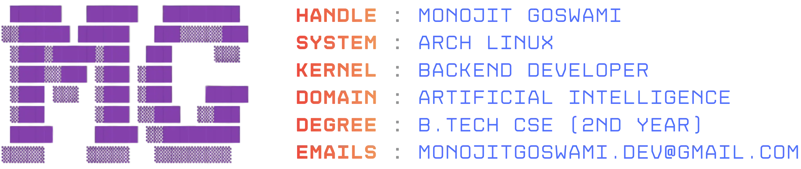
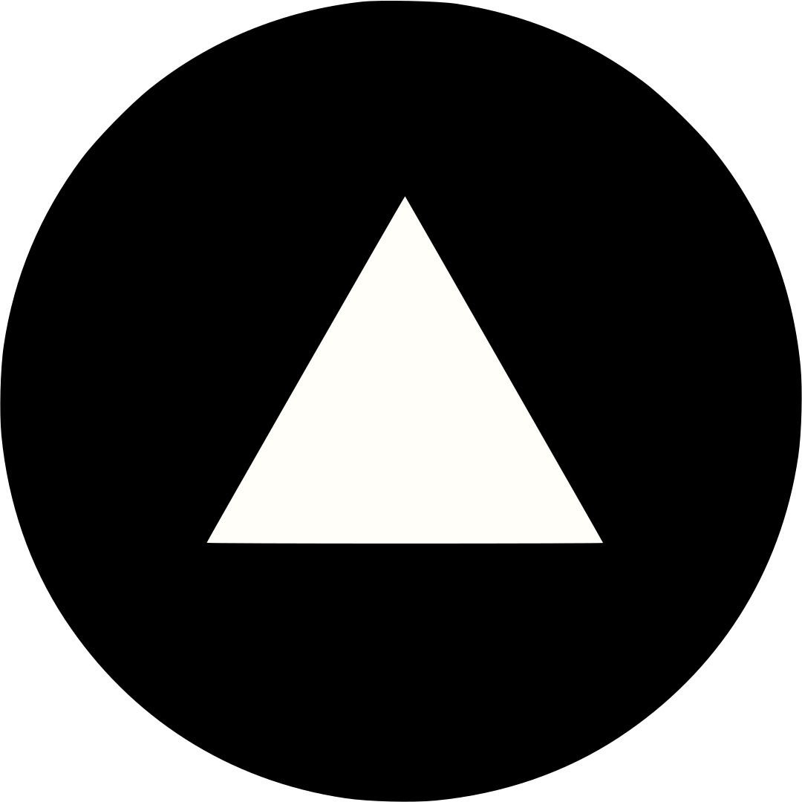

<picture>
  <source media="(prefers-color-scheme: dark)" srcset="assets/dark.webp" />
  <source media="(prefers-color-scheme: light)" srcset="assets/light.webp" />
  
</picture>

# Hola, I’m Monojit Goswami - aka **MG**!

<a href="https://x.com/monojitgoswami9" target="_blank"><picture><source media="(prefers-color-scheme: dark)" srcset="assets/findme/x-dark.svg" /><source media="(prefers-color-scheme: light)" srcset="assets/findme/x-light.svg" /></picture></a><a href="https://linkedin.com/in/monojitgoswami69" target="_blank"><picture><source media="(prefers-color-scheme: dark)" srcset="assets/findme/linkedin-dark.svg" /><source media="(prefers-color-scheme: light)" srcset="assets/findme/linkedin-light.svg" /></picture></a><a href="https://mgbuilds.in" target="_blank"><picture><source media="(prefers-color-scheme: dark)" srcset="assets/findme/website-dark.svg" /><source media="(prefers-color-scheme: light)" srcset="assets/findme/website-light.svg" /></picture></a>

I am Monojit Goswami, a second-year B.Tech student in Computer Science and Engineering and a self-taught backend developer. I work primarily with Python and focus on building reliable, high-performance backend systems.

My work centers on RAG-based agentic systems and efficient machine learning pipelines, with an emphasis on clean architecture, modular design, security, and scalability. I enjoy building general-purpose backend solutions that are stable in production while integrating intelligence in a practical, maintainable way.

### Skills and Tools  

 

## GitHub Stats 

<picture>
  <source media="(prefers-color-scheme: dark)" srcset="https://github-readme-stats-mg69.vercel.app/api?username=monojitgoswami69&theme=radical&hide_border=false&show_icons=true&border_radius=25&include_all_commits=true&hide=contribs&rank_icon=github&hide_title=true" />
  <source media="(prefers-color-scheme: light)" srcset="https://github-readme-stats-mg69.vercel.app/api?username=monojitgoswami69&theme=buefy&hide_border=false&show_icons=true&border_radius=25&include_all_commits=true&hide=contribs&rank_icon=github&hide_title=true&border_color=a8a8a8" />
  
</picture> 

<picture>
  <source media="(prefers-color-scheme: dark)" srcset="https://github-readme-streak-stats-mg69.vercel.app/?user=monojitgoswami69&theme=radical&border_radius=25" />
  <source media="(prefers-color-scheme: light)" srcset="https://github-readme-streak-stats-mg69.vercel.app/?user=monojitgoswami69&theme=buefy&border_radius=25&border_color=a8a8a8" />
  
</picture>

<picture>
  <source media="(prefers-color-scheme: dark)" srcset="https://github.com/monojitgoswami69/monojitgoswami69/blob/output/github-snake-dark.svg" width="100%"/>
  <source media="(prefers-color-scheme: light)" srcset="https://github.com/monojitgoswami69/monojitgoswami69/blob/output/github-snake.svg" width="100%" />
  
</picture>

<h1></h1>

<i>“Code with style. Build with joy. Break stuff - then fix it better.”</i> - MG, *maybe*

